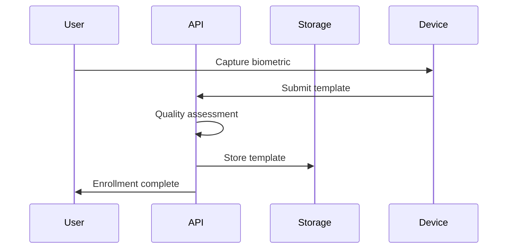
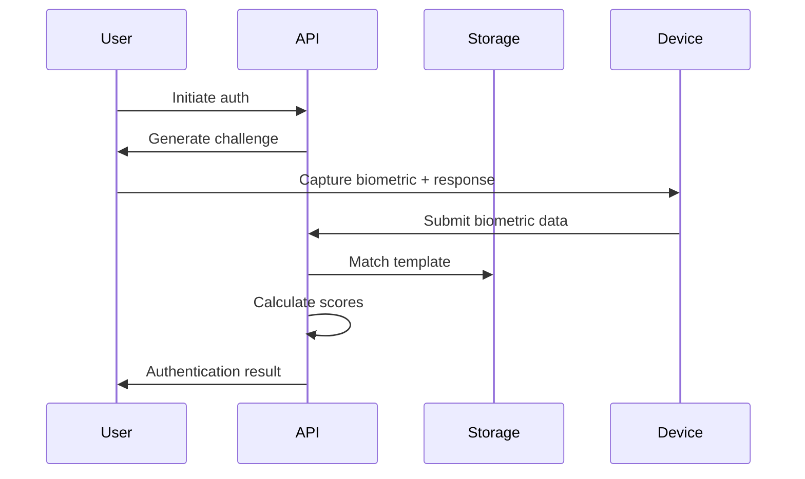

# Biometric Authentication API

A comprehensive biometric authentication system supporting multiple biometric modalities with advanced security features and liveness detection.

## Features

- **Multi-Modal Biometrics**: Support for fingerprint, face, voice, iris, retina, palm, signature, and keystroke dynamics
- **Liveness Detection**: Advanced anti-spoofing with challenge-response mechanisms
- **Template Management**: Secure storage and management of biometric templates
- **Security Policies**: Configurable authentication policies and thresholds
- **Audit Logging**: Complete audit trail of all authentication events
- **Account Security**: Lockout mechanisms and failed attempt tracking
- **Real-time Processing**: Asynchronous authentication processing
- **Quality Assessment**: Biometric sample quality evaluation
- **Multi-Factor Support**: Integration with other authentication factors

## API Endpoints

### User Management

#### Create User
```http
POST /api/users?username=john_doe&email=john@example.com&full_name=John Doe
```

#### Get User
```http
GET /api/users/{user_id}
```

### Biometric Templates

#### Create Biometric Template
```http
POST /api/users/{user_id}/biometric-templates
Content-Type: application/json

{
  "biometric_type": "fingerprint",
  "template_data": "base64_encoded_template_data",
  "device_info": {
    "device_id": "scanner_001",
    "manufacturer": "SecuGen",
    "model": "Hamster Pro"
  }
}
```

#### Get User Templates
```http
GET /api/users/{user_id}/biometric-templates?biometric_type=fingerprint
```

#### Delete Template
```http
DELETE /api/users/{user_id}/biometric-templates/{template_id}
```

### Authentication

#### Initiate Authentication
```http
POST /api/authenticate
Content-Type: application/json

{
  "user_id": "user_123",
  "biometric_type": "face",
  "biometric_data": "base64_encoded_biometric_data",
  "device_id": "camera_001"
}
```

#### Get Authentication Result
```http
GET /api/authenticate/{request_id}/result
```

#### Generate Liveness Challenge
```http
POST /api/authenticate/{request_id}/challenge
```

### Account Management

#### Unlock User Account
```http
POST /api/users/{user_id}/unlock
```

#### Get Audit Logs
```http
GET /api/users/{user_id}/audit-logs?limit=100&event_type=login
```

### Reference

#### Get Statistics
```http
GET /api/stats
```

#### Get Supported Biometric Types
```http
GET /api/biometric-types
```

## Data Models

### User
```json
{
  "id": "user_123",
  "username": "john_doe",
  "email": "john@example.com",
  "full_name": "John Doe",
  "is_active": true,
  "created_at": "2024-01-01T12:00:00",
  "last_login": "2024-01-01T15:30:00",
  "failed_attempts": 0,
  "locked_until": null,
  "biometric_templates": ["template_001", "template_002"]
}
```

### Biometric Template
```json
{
  "id": "template_001",
  "user_id": "user_123",
  "biometric_type": "fingerprint",
  "template_data": "base64_encoded_template",
  "quality_score": 0.92,
  "created_at": "2024-01-01T12:00:00",
  "is_active": true,
  "device_info": {
    "device_id": "scanner_001",
    "manufacturer": "SecuGen"
  }
}
```

### Authentication Request
```json
{
  "user_id": "user_123",
  "biometric_type": "face",
  "biometric_data": "base64_encoded_face_data",
  "device_id": "camera_001",
  "challenge": "blink_twice"
}
```

### Authentication Result
```json
{
  "request_id": "req_123",
  "user_id": "user_123",
  "biometric_type": "face",
  "status": "authenticated",
  "confidence_score": 0.94,
  "match_score": 0.96,
  "liveness_score": 0.91,
  "processing_time": 0.245,
  "timestamp": "2024-01-01T12:00:00"
}
```

### Audit Log
```json
{
  "id": "log_123",
  "user_id": "user_123",
  "event_type": "login",
  "biometric_type": "face",
  "success": true,
  "ip_address": "192.168.1.100",
  "user_agent": "Mozilla/5.0...",
  "timestamp": "2024-01-01T12:00:00",
  "details": {
    "confidence": 0.94,
    "match_score": 0.96
  }
}
```

## Supported Biometric Types

### 1. Fingerprint Recognition
- **Accuracy**: 95%
- **Liveness Support**: Yes
- **Template Size**: ~500 bytes
- **Processing Time**: ~100ms
- **Use Cases**: Access control, mobile devices, time tracking

### 2. Face Recognition
- **Accuracy**: 97%
- **Liveness Support**: Yes (blink, smile, head movement)
- **Template Size**: ~2KB
- **Processing Time**: ~200ms
- **Use Cases**: Surveillance, mobile unlock, attendance

### 3. Iris Recognition
- **Accuracy**: 99%
- **Liveness Support**: Yes (pupil response)
- **Template Size**: ~1KB
- **Processing Time**: ~150ms
- **Use Cases**: High-security access, border control

### 4. Voice Recognition
- **Accuracy**: 92%
- **Liveness Support**: Yes (random phrases)
- **Template Size**: ~3KB
- **Processing Time**: ~300ms
- **Use Cases**: Phone banking, smart speakers

### 5. Retina Scan
- **Accuracy**: 98%
- **Liveness Support**: No
- **Template Size**: ~4KB
- **Processing Time**: ~250ms
- **Use Cases**: High-security facilities, military

### 6. Palm Recognition
- **Accuracy**: 94%
- **Liveness Support**: Yes (temperature, pressure)
- **Template Size**: ~1.5KB
- **Processing Time**: ~180ms
- **Use Cases**: Time attendance, access control

### 7. Signature Verification
- **Accuracy**: 88%
- **Liveness Support**: No
- **Template Size**: ~500 bytes
- **Processing Time**: ~120ms
- **Use Cases**: Document verification, banking

### 8. Keystroke Dynamics
- **Accuracy**: 85%
- **Liveness Support**: Yes
- **Template Size**: ~200 bytes
- **Processing Time**: ~50ms
- **Use Cases**: Continuous authentication, fraud detection

## Authentication Flow

### 1. Enrollment Process


### 2. Authentication Process


## Security Features

### Liveness Detection
- **Face Recognition**: Blink detection, smile challenge, head movement
- **Fingerprint**: Pulse detection, pressure analysis
- **Voice**: Random phrase generation, voice stress analysis
- **Iris**: Pupil response, light reflection analysis

### Anti-Spoofing Measures
- **Template Encryption**: AES-256 encryption of stored templates
- **Challenge-Response**: Dynamic challenges for each authentication
- **Device Fingerprinting**: Device validation and tracking
- **Rate Limiting**: Prevent brute force attacks

### Account Security
- **Failed Attempt Tracking**: Monitor authentication failures
- **Account Lockout**: Temporary lock after multiple failures
- **Audit Trail**: Complete logging of all events
- **Session Management**: Secure session handling

## Installation

```bash
pip install fastapi uvicorn
```

## Usage

```bash
python app.py
```

The API will be available at `http://localhost:8000`

## Example Usage

### Python Client
```python
import requests
import base64
import json

# Create a user
user_data = {
    "username": "alice",
    "email": "alice@example.com",
    "full_name": "Alice Smith"
}

response = requests.post("http://localhost:8000/api/users", params=user_data)
user = response.json()
print(f"Created user: {user['id']}")

# Create biometric template (mock fingerprint data)
fingerprint_data = base64.b64encode(b"mock_fingerprint_template_data").decode()

template_data = {
    "biometric_type": "fingerprint",
    "template_data": fingerprint_data,
    "device_info": {
        "device_id": "scanner_001",
        "manufacturer": "SecuGen"
    }
}

response = requests.post(f"http://localhost:8000/api/users/{user['id']}/biometric-templates", json=template_data)
template = response.json()
print(f"Created template: {template['id']}")

# Authenticate user
auth_request = {
    "user_id": user['id'],
    "biometric_type": "fingerprint",
    "biometric_data": fingerprint_data,
    "device_id": "scanner_001"
}

response = requests.post("http://localhost:8000/api/authenticate", json=auth_request)
auth_result = response.json()
request_id = auth_result['request_id']

# Check authentication result
import time
time.sleep(1)  # Wait for processing

response = requests.get(f"http://localhost:8000/api/authenticate/{request_id}/result")
result = response.json()

print(f"Authentication Status: {result['status']}")
print(f"Confidence Score: {result['confidence_score']:.3f}")
print(f"Match Score: {result['match_score']:.3f}")
if result['liveness_score']:
    print(f"Liveness Score: {result['liveness_score']:.3f}")
```

### JavaScript Client
```javascript
// Create user
const userData = new URLSearchParams({
  username: 'bob',
  email: 'bob@example.com',
  full_name: 'Bob Johnson'
});

const userResponse = await fetch('http://localhost:8000/api/users', {
  method: 'POST',
  body: userData
});
const user = await userResponse.json();

// Create face template
const faceData = btoa('mock_face_template_data');

const templateData = {
  biometric_type: 'face',
  template_data: faceData,
  device_info: {
    device_id: 'camera_001',
    manufacturer: 'Logitech'
  }
};

const templateResponse = await fetch(`http://localhost:8000/api/users/${user.id}/biometric-templates`, {
  method: 'POST',
  headers: { 'Content-Type': 'application/json' },
  body: JSON.stringify(templateData)
});
const template = await templateResponse.json();

// Authenticate with challenge
const authResponse = await fetch('http://localhost:8000/api/authenticate', {
  method: 'POST',
  headers: { 'Content-Type': 'application/json' },
  body: JSON.stringify({
    user_id: user.id,
    biometric_type: 'face',
    biometric_data: faceData,
    device_id: 'camera_001'
  })
});
const auth = await authResponse.json();

// Get liveness challenge
const challengeResponse = await fetch(`http://localhost:8000/api/authenticate/${auth.request_id}/challenge`, {
  method: 'POST'
});
const challenge = await challengeResponse.json();

console.log(`Liveness Challenge: ${challenge.challenge}`);

// Submit authentication with challenge response
// (In real implementation, this would include the challenge response)

// Check result
setTimeout(async () => {
  const resultResponse = await fetch(`http://localhost:8000/api/authenticate/${auth.request_id}/result`);
  const result = await resultResponse.json();
  
  console.log(`Status: ${result.status}`);
  console.log(`Confidence: ${result.confidence_score.toFixed(3)}`);
}, 1000);
```

## Configuration

### Environment Variables
```bash
# Server Configuration
HOST=0.0.0.0
PORT=8000

# Security Settings
MIN_CONFIDENCE_THRESHOLD=0.7
MAX_FAILED_ATTEMPTS=3
LOCKOUT_DURATION_MINUTES=15
SESSION_TIMEOUT_MINUTES=30

# Template Storage
TEMPLATE_ENCRYPTION_KEY=your-encryption-key
TEMPLATE_RETENTION_DAYS=365
MAX_TEMPLATES_PER_USER=10

# Liveness Detection
LIVENESS_CHALLENGE_TIMEOUT=30
FACE_LIVENESS_ENABLED=true
FINGERPRINT_LIVENESS_ENABLED=true

# Performance
MAX_CONCURRENT_AUTH=100
AUTHENTICATION_TIMEOUT=60
QUALITY_THRESHOLD=0.6

# Logging
LOG_LEVEL=info
AUDIT_RETENTION_DAYS=90
ENABLE_DETAILED_LOGGING=true
```

## Use Cases

- **Enterprise Access Control**: Secure building and system access
- **Mobile Authentication**: Biometric unlock for mobile apps
- **Banking and Finance**: Secure transaction authentication
- **Healthcare**: Patient identification and record access
- **Government Services**: Identity verification for public services
- **E-commerce**: Secure payment authentication
- **Education**: Student attendance and exam authentication

## Advanced Features

### Multi-Factor Authentication
```json
{
  "authentication_factors": [
    {
      "type": "biometric",
      "biometric_type": "face",
      "required": true
    },
    {
      "type": "knowledge",
      "method": "pin",
      "required": false
    },
    {
      "type": "possession",
      "method": "mobile_app",
      "required": false
    }
  ]
}
```

### Adaptive Authentication
- **Context-Aware**: Adjust security based on location, time, device
- **Risk-Based**: Dynamic confidence thresholds
- **Continuous Authentication**: Ongoing verification during session

### Template Protection
- **Cancelable Biometrics**: Revocable template generation
- **Biometric Encryption**: Template-level encryption
- **Secure Multi-Party Computation**: Privacy-preserving matching

## Integration Examples

### Mobile App Integration
```java
// Android biometric authentication
public class BiometricAuthManager {
    public void authenticate(String userId, BiometricData data) {
        // Capture biometric data
        byte[] template = captureBiometric(data);
        
        // Send to API
        AuthenticationRequest request = new AuthenticationRequest(
            userId, "fingerprint", 
            Base64.encodeToString(template, Base64.DEFAULT)
        );
        
        apiService.authenticate(request, new Callback<AuthResult>() {
            @Override
            public void onResponse(AuthResult result) {
                if (result.getStatus() == "authenticated") {
                    // Grant access
                    grantAccess();
                }
            }
        });
    }
}
```

### Web Integration
```javascript
// WebAuthn + Biometric API
class BiometricWebAuth {
    async authenticate(userId) {
        // Use WebAuthn for browser biometric support
        const credential = await navigator.credentials.get({
            publicKey: {
                challenge: new Uint8Array(32),
                allowCredentials: [{
                    id: this.userIdToCredentialId(userId),
                    type: 'public-key',
                    transports: ['internal', 'usb', 'nfc', 'ble']
                }],
                userVerification: 'required'
            }
        });
        
        // Send to backend for verification
        return this.verifyCredential(userId, credential);
    }
}
```

## Production Considerations

- **GDPR Compliance**: Biometric data protection regulations
- **ISO/IEC Standards**: Compliance with biometric standards
- **Hardware Integration**: Support for various biometric scanners
- **Scalability**: Horizontal scaling for high-volume deployments
- **Backup and Recovery**: Secure template backup strategies
- **Testing**: Comprehensive testing with diverse biometric samples
- **Monitoring**: Real-time system health and performance monitoring

## Security Best Practices

1. **Template Encryption**: Always encrypt stored biometric templates
2. **Secure Transmission**: Use TLS for all API communications
3. **Input Validation**: Validate all biometric data inputs
4. **Rate Limiting**: Implement proper rate limiting
5. **Audit Logging**: Maintain comprehensive audit trails
6. **Regular Updates**: Keep biometric algorithms updated
7. **Privacy by Design**: Minimize biometric data collection
8. **User Consent**: Obtain explicit user consent for biometric usage
