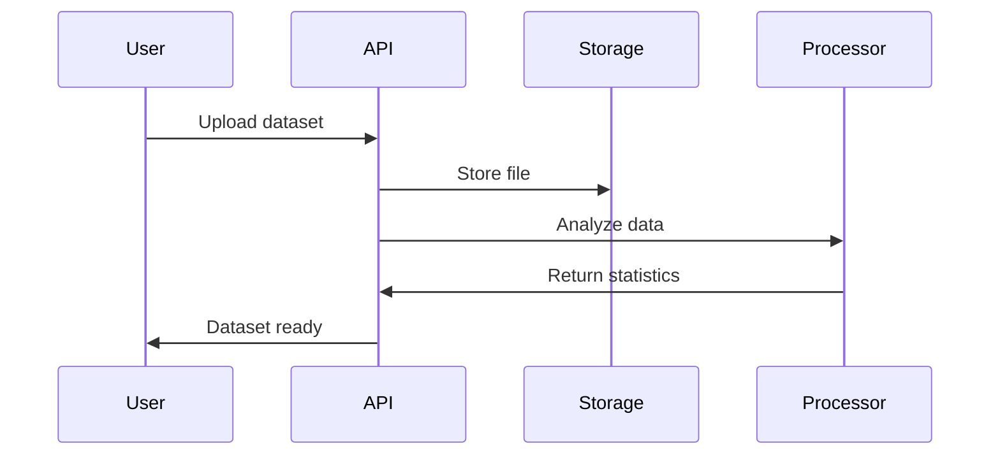
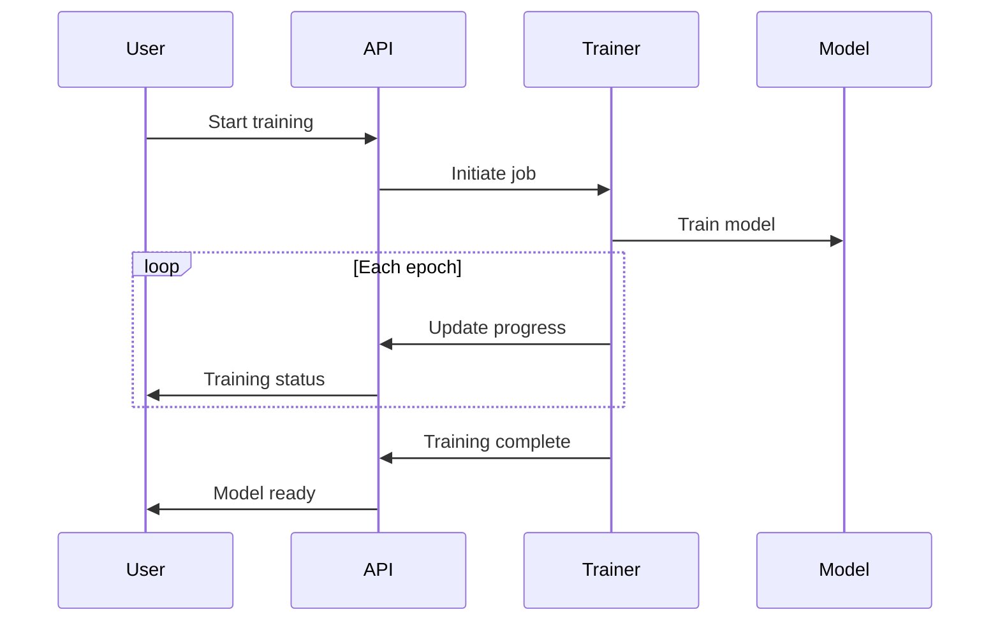

# Machine Learning Model Training API

A comprehensive machine learning platform for dataset management, model training, and prediction serving with support for multiple ML algorithms and real-time training monitoring.

## Features

- **Dataset Management**: Upload, process, and analyze datasets with automatic statistics
- **Model Training**: Train various ML models (classification, regression, clustering, neural networks)
- **Real-time Training**: Monitor training progress with live metrics and epoch tracking
- **Hyperparameter Tuning**: Configurable hyperparameters for all model types
- **Prediction Service**: Deploy trained models for inference with confidence scores
- **Training Jobs**: Asynchronous training with job management and cancellation
- **Model Registry**: Complete model lifecycle management
- **Performance Metrics**: Accuracy, loss, validation metrics, and training history

## API Endpoints

### Dataset Management

#### Upload Dataset
```http
POST /api/datasets
Content-Type: multipart/form-data

name: Sales Dataset
description: Historical sales data for prediction
data_type: csv
target_column: sales
file: [dataset file]
```

#### Get All Datasets
```http
GET /api/datasets?data_type=csv
```

#### Get Specific Dataset
```http
GET /api/datasets/{dataset_id}
```

### Model Management

#### Create Model
```http
POST /api/models
Content-Type: application/json

{
  "name": "Sales Prediction Model",
  "model_type": "regression",
  "dataset_id": "dataset_123",
  "hyperparameters": {
    "epochs": 50,
    "learning_rate": 0.001,
    "batch_size": 32
  }
}
```

#### Get All Models
```http
GET /api/models?model_type=classification&status=completed
```

#### Get Specific Model
```http
GET /api/models/{model_id}
```

### Training Operations

#### Start Training
```http
POST /api/models/{model_id}/train
```

#### Get Training Job Status
```http
GET /api/training-jobs/{job_id}
```

#### Cancel Training
```http
POST /api/training-jobs/{job_id}/cancel
```

### Prediction Service

#### Make Prediction
```http
POST /api/predict
Content-Type: application/json

{
  "model_id": "model_123",
  "input_data": {
    "feature_0": 25.5,
    "feature_1": 15000,
    "feature_2": 3.2
  },
  "return_probabilities": true
}
```

#### Get Prediction History
```http
GET /api/models/{model_id}/predictions?limit=100
```

### Reference

#### Get Supported Model Types
```http
GET /api/model-types
```

#### Get Platform Statistics
```http
GET /api/stats
```

## Data Models

### Dataset
```json
{
  "id": "dataset_123",
  "name": "Sales Dataset",
  "description": "Historical sales data",
  "file_path": "uploads/dataset_123_sales.csv",
  "data_type": "csv",
  "size": 1048576,
  "rows": 10000,
  "columns": 12,
  "features": ["feature_0", "feature_1", "feature_2"],
  "target_column": "sales",
  "created_at": "2024-01-01T12:00:00",
  "is_processed": true,
  "statistics": {
    "total_rows": 10000,
    "data_types": {"feature_0": "numeric", "feature_1": "numeric"},
    "missing_values": {"feature_0": 0, "feature_1": 5},
    "numeric_stats": {
      "feature_0": {"mean": 25.5, "std": 5.2, "min": 10, "max": 40}
    }
  }
}
```

### Model
```json
{
  "id": "model_123",
  "name": "Sales Prediction Model",
  "model_type": "regression",
  "dataset_id": "dataset_123",
  "hyperparameters": {
    "epochs": 50,
    "learning_rate": 0.001,
    "batch_size": 32
  },
  "metrics": {},
  "training_status": "completed",
  "created_at": "2024-01-01T12:00:00",
  "completed_at": "2024-01-01T12:30:00",
  "accuracy": 0.92,
  "loss": 0.08,
  "training_time": 1800.5
}
```

### Training Job
```json
{
  "id": "job_123",
  "model_id": "model_123",
  "dataset_id": "dataset_123",
  "status": "training",
  "progress": 0.75,
  "current_epoch": 38,
  "total_epochs": 50,
  "started_at": "2024-01-01T12:00:00",
  "metrics_history": [
    {
      "epoch": 1,
      "accuracy": 0.65,
      "loss": 0.85,
      "val_accuracy": 0.62,
      "val_loss": 0.88
    },
    {
      "epoch": 38,
      "accuracy": 0.91,
      "loss": 0.12,
      "val_accuracy": 0.89,
      "val_loss": 0.15
    }
  ]
}
```

### Prediction Result
```json
{
  "model_id": "model_123",
  "prediction": 1250.75,
  "probabilities": null,
  "confidence": 0.89,
  "timestamp": "2024-01-01T13:00:00"
}
```

## Supported Model Types

### 1. Classification
- **Algorithms**: Logistic Regression, Random Forest, SVM, Neural Networks
- **Use Cases**: Binary and multi-class classification
- **Metrics**: Accuracy, Precision, Recall, F1-Score, ROC-AUC
- **Default Hyperparameters**: epochs=10, learning_rate=0.001, batch_size=32

### 2. Regression
- **Algorithms**: Linear Regression, Random Forest, SVM, Neural Networks
- **Use Cases**: Continuous value prediction
- **Metrics**: MSE, MAE, R² Score
- **Default Hyperparameters**: epochs=10, learning_rate=0.001, batch_size=32

### 3. Clustering
- **Algorithms**: K-Means, Hierarchical, DBSCAN
- **Use Cases**: Unsupervised data grouping
- **Metrics**: Silhouette Score, Davies-Bouldin Index
- **Default Hyperparameters**: n_clusters=3, max_iter=100

### 4. Neural Networks
- **Algorithms**: CNN, RNN, LSTM, Transformer
- **Use Cases**: Deep learning applications
- **Metrics**: Task-specific metrics
- **Default Hyperparameters**: epochs=20, learning_rate=0.001, batch_size=64

## Training Process

### 1. Dataset Preparation


### 2. Model Training


## Installation

```bash
pip install fastapi uvicorn numpy pandas scikit-learn
```

## Usage

```bash
python app.py
```

The API will be available at `http://localhost:8000`

## Example Usage

### Python Client
```python
import requests
import json

# Upload dataset
dataset_data = {
    "name": "Iris Dataset",
    "description": "Classic iris classification dataset",
    "data_type": "csv",
    "target_column": "species"
}

response = requests.post("http://localhost:8000/api/datasets", data=dataset_data)
dataset = response.json()
print(f"Created dataset: {dataset['id']}")

# Create model
model_data = {
    "name": "Iris Classifier",
    "model_type": "classification",
    "dataset_id": dataset['id'],
    "hyperparameters": {
        "epochs": 20,
        "learning_rate": 0.01,
        "batch_size": 16
    }
}

response = requests.post("http://localhost:8000/api/models", json=model_data)
model = response.json()
print(f"Created model: {model['id']}")

# Start training
response = requests.post(f"http://localhost:8000/api/models/{model['id']}/train")
job = response.json()
print(f"Training job: {job['id']}")

# Monitor training
import time
while True:
    response = requests.get(f"http://localhost:8000/api/training-jobs/{job['id']}")
    current_job = response.json()
    
    print(f"Progress: {current_job['progress']:.1%}, Epoch: {current_job['current_epoch']}/{current_job['total_epochs']}")
    
    if current_job['status'] in ['completed', 'failed', 'cancelled']:
        break
    
    time.sleep(2)

# Make prediction
if current_job['status'] == 'completed':
    prediction_data = {
        "model_id": model['id'],
        "input_data": {
            "sepal_length": 5.1,
            "sepal_width": 3.5,
            "petal_length": 1.4,
            "petal_width": 0.2
        },
        "return_probabilities": True
    }
    
    response = requests.post("http://localhost:8000/api/predict", json=prediction_data)
    result = response.json()
    
    print(f"Prediction: {result['prediction']}")
    print(f"Confidence: {result['confidence']:.3f}")
    if result['probabilities']:
        print("Probabilities:")
        for class_name, prob in result['probabilities'].items():
            print(f"  {class_name}: {prob:.3f}")
```

### JavaScript Client
```javascript
// Upload dataset
const datasetData = new FormData();
datasetData.append('name', 'Customer Churn Dataset');
datasetData.append('description', 'Customer churn prediction data');
datasetData.append('data_type', 'csv');
datasetData.append('target_column', 'churn');

const datasetResponse = await fetch('http://localhost:8000/api/datasets', {
  method: 'POST',
  body: datasetData
});
const dataset = await datasetResponse.json();

// Create and train model
const modelData = {
  name: 'Churn Predictor',
  model_type: 'classification',
  dataset_id: dataset.id,
  hyperparameters: {
    epochs: 30,
    learning_rate: 0.005,
    batch_size: 64
  }
};

const modelResponse = await fetch('http://localhost:8000/api/models', {
  method: 'POST',
  headers: { 'Content-Type': 'application/json' },
  body: JSON.stringify(modelData)
});
const model = await modelResponse.json();

// Start training
const trainingResponse = await fetch(`http://localhost:8000/api/models/${model.id}/train`, {
  method: 'POST'
});
const job = await trainingResponse.json();

// Monitor training with polling
const monitorTraining = async () => {
  const jobResponse = await fetch(`http://localhost:8000/api/training-jobs/${job.id}`);
  const currentJob = await jobResponse.json();
  
  console.log(`Training: ${Math.round(currentJob.progress * 100)}% complete`);
  console.log(`Epoch: ${currentJob.current_epoch}/${currentJob.total_epochs}`);
  
  if (currentJob.status === 'completed') {
    console.log('Training completed!');
    
    // Make prediction
    const predictionData = {
      model_id: model.id,
      input_data: {
        tenure: 12,
        monthly_charges: 75.50,
        contract_type: 'month-to-month'
      },
      return_probabilities: true
    };
    
    const predResponse = await fetch('http://localhost:8000/api/predict', {
      method: 'POST',
      headers: { 'Content-Type': 'application/json' },
      body: JSON.stringify(predictionData)
    });
    
    const result = await predResponse.json();
    console.log(`Churn Prediction: ${result.prediction}`);
    console.log(`Confidence: ${(result.confidence * 100).toFixed(1)}%`);
  } else if (currentJob.status !== 'training') {
    console.log(`Training failed: ${currentJob.error_message}`);
  } else {
    setTimeout(monitorTraining, 2000); // Poll again in 2 seconds
  }
};

monitorTraining();
```

## Configuration

### Environment Variables
```bash
# Server Configuration
HOST=0.0.0.0
PORT=8000

# Dataset Storage
UPLOAD_DIR=./uploads
MAX_FILE_SIZE=100MB
SUPPORTED_FORMATS=csv,json,parquet,excel

# Model Training
MAX_CONCURRENT_TRAINING=5
DEFAULT_EPOCHS=10
TRAINING_TIMEOUT=3600
MODEL_STORAGE_DIR=./models

# Database (for persistence)
DATABASE_URL=sqlite:///./ml_platform.db

# Performance
ENABLE_CACHING=true
CACHE_TTL=3600
PREDICTION_BATCH_SIZE=100

# Logging
LOG_LEVEL=info
ENABLE_TRAINING_LOGS=true
METRICS_RETENTION_DAYS=30
```

## Use Cases

- **Data Science Teams**: Centralized ML model development and deployment
- **Business Analytics**: Predictive modeling for business insights
- **Research**: Academic ML experiments and reproducibility
- **Production ML**: Model serving and monitoring in production
- **Education**: ML learning and experimentation platform
- **Startups**: Quick ML prototyping and deployment

## Advanced Features

### Hyperparameter Optimization
```json
{
  "hyperparameter_tuning": {
    "method": "grid_search",
    "parameters": {
      "learning_rate": [0.001, 0.01, 0.1],
      "batch_size": [16, 32, 64],
      "epochs": [10, 20, 50]
    },
    "cv_folds": 5,
    "scoring_metric": "accuracy"
  }
}
```

### Model Versioning
- **Version Control**: Track model iterations
- **Rollback**: Revert to previous model versions
- **A/B Testing**: Compare model performance
- **Deployment Management**: Staged model deployment

### Feature Engineering
- **Automated Preprocessing**: Data cleaning and transformation
- **Feature Selection**: Automatic feature importance ranking
- **Pipeline Management**: Reproducible data processing pipelines
- **Custom Transformers**: User-defined feature transformations

## Integration Examples

### Jupyter Notebook
```python
import requests
import matplotlib.pyplot as plt

# Train model and monitor
job = train_model(model_id)

# Plot training history
history = []
while job['status'] == 'training':
    job = get_training_job(job['id'])
    if job['metrics_history']:
        history.append(job['metrics_history'][-1])
    
plt.plot([h['epoch'] for h in history], [h['accuracy'] for h in history])
plt.title('Training Accuracy')
plt.xlabel('Epoch')
plt.ylabel('Accuracy')
plt.show()
```

### Airflow Integration
```python
from airflow import DAG
from airflow.operators.python import PythonOperator
import requests

def train_model_task(**context):
    model_id = context['params']['model_id']
    response = requests.post(f"http://ml-api:8000/api/models/{model_id}/train")
    job = response.json()
    
    # Wait for completion
    while True:
        job_response = requests.get(f"http://ml-api:8000/api/training-jobs/{job['id']}")
        current_job = job_response.json()
        
        if current_job['status'] == 'completed':
            return job['id']
        elif current_job['status'] == 'failed':
            raise Exception(f"Training failed: {current_job['error_message']}")
```

## Production Considerations

- **Scalability**: Horizontal scaling for training and inference
- **Model Storage**: Efficient model serialization and storage
- **Monitoring**: Real-time training and inference monitoring
- **Security**: Model access control and data privacy
- **Resource Management**: GPU/CPU resource allocation
- **Experiment Tracking**: MLflow integration for experiment management
